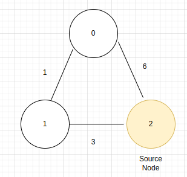

import Tabs from '@theme/Tabs';
import TabItem from '@theme/TabItem';

### Why Dijkstra's algorithm Exist ? 

> `Dijkstra's algorithm` is an algorithm for finding the `shortest path between 2 given nodes` in a weighted graph.in problem solving questions we mostly use dijkstra to get the shortest path from a given source node to all the other nodes in a graph that's why we called this algorithm as a `Single Source Shortest Path`.

:::note
weights should be non-negative otherwise it will create a negative weight cycle which in turns produce the infinite loop
:::

### Lets take an example that what we mean by shortest path in graph ?

#### Input



```
V(Nodes) = 3, E(edges) = 3
u = 0, v = 1, w = 1 -> edge 1
u = 1, v = 2, w = 3 -> edge 2
u = 0, v = 2, w = 6 -> edge 3
```

#### Explainiation

- shortest distance between `2 -> 0`, so there are 2 paths 
    - one is `2 -> 0` and tot_distance is `6`
    - second is `2 -> 1 -> 0` and tot_distance is `3+1` = `4`
    - hence shortest distance from `2->0` is `4`. 
- shortest distance between 2 -> 1, so there are 2 paths
    - one is `2 -> 1` and tot_distance is `3`
    - second is `2 -> 0 -> 1` and tot_distance is `6+1` = `7`
    - hence shortest distance from `2->0` is `3`.
- so output is an array with `V` NUmber of elements -> [4,3,0] means `2->0: 4(shortest path)`,`2->1: 3(shortest path)`, `2->2: 0(shortest path)`  

### Lets understand how this algorithm works ?


- hence from above image we can see that first we add the source node in the `min-heap-priority-queue`
- then iterate the process until the queue is empty
    - first poll from the queue we got `node` and `weight` then go to each and every neighbour and compare the `dist[neighbour_node]` and `weight+weight[node->neightbour_node]` if `weight+weight[node->neightbour_node]` <  `dist[neighbour_node]` hence update the `dist[neighbour_node]=weight+weight[node->neightbour_node]`
    - and put `(neighbour_node,dist[neighbour_node])` in the priority queue
- when priority-queue becomes empty return dist array.

:::note
we use priority queue because we need to track the path with shortest distance and min-heap-priority-queue helps to select
:::

### You can implement this algorithm at

- https://practice.geeksforgeeks.org/problems/implementing-dijkstra-set-1-adjacency-matrix/1


### Code

<Tabs>
<TabItem value="java" label="Java">

```js
import java.util.*;

class Main{
    // main function
    public static int[] dijkstra(int V, ArrayList<ArrayList<ArrayList<Integer>>> adj, int S)
    {
        int[] dis = new int[V];// distance array
        // distance from a node from source to all other node is infinite for now and distance from S to S is 0
        for(int i=0;i<V;i++){
            if(S!=i)dis[i] = Integer.MAX_VALUE;
        }
        // Priority Queue to select the shortest distance first, min-heap-priority-queue
        PriorityQueue<int[]> pq = new PriorityQueue<>((a,b)->a[1]-b[1]);// consist of [node,dis]
        pq.add(new int[]{S,0});// add source node to S and dis to be 0 
        while(!pq.isEmpty()){
            int[] element = pq.poll();// poll the node
            int node = element[0],wt = element[1];
            // get all the neighbour of node
            ArrayList<ArrayList<Integer>> neighbours = adj.get(node);
            for (ArrayList<Integer> neigh : neighbours) {
                int neigh_node = neigh.get(0),dis_from_node = neigh.get(1);
                if(wt+dis_from_node < dis[neigh_node]){
                    dis[neigh_node] = wt+dis_from_node;// update the distance of neigh node
                    pq.add(new int[]{neigh_node,dis[neigh_node]});
                }
            }
        }
        return dis;
    }
    public static ArrayList<ArrayList<ArrayList<Integer>>> createGraph(int V,int E,int[][] edges){
        ArrayList<ArrayList<ArrayList<Integer>>> adj = new ArrayList<>();
        // there are V nodes
        for(int i=0;i<V;i++){
            adj.add(new ArrayList<>());
        }
        // iterate through all the edges
        for(int i=0;i<E;i++){
            int[] edge = edges[i];
            int u = edge[0],v = edge[1],w = edge[2];
            adj.get(u).add(new ArrayList<>(Arrays.asList(v,w)));// connect u to v with weight w
            adj.get(v).add(new ArrayList<>(Arrays.asList(u,w)));// connect v to u with weight w
        }
        return adj;
    }
    public static void main(String args[]){
        // input section
        int V = 3,E = 3,S = 2;// V is number of nodes and E is number of edges, S is source node
        int[][] edges = {{0,1,1},{1,2,3},{0,2,6}};// each array consists of {u,v,w}, note it is undirected graph
        ArrayList<ArrayList<ArrayList<Integer>>> adj = createGraph(V,E,edges);  
        int[] res = dijkstra(V, adj, S);
        // print output
        for(int r: res)System.out.print(r+" ");
    } 
}


```

</TabItem>

<TabItem value="other" label="Other">

```
currently no other languages supported
```

</TabItem>

</Tabs>

### Time Complexity
> `O(Vlog(V) + E)`

### Problem Solving Questions

- [network delay time](./network_delay_time.mdx)