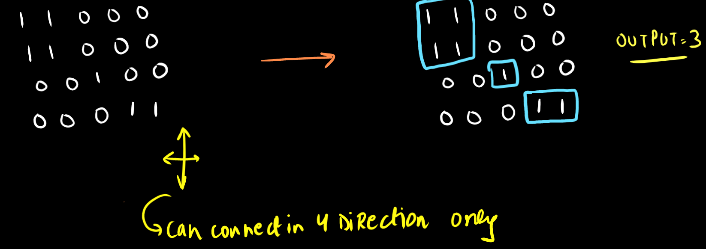
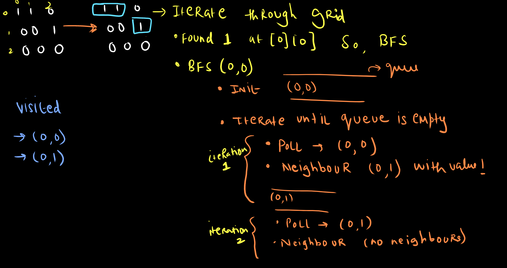
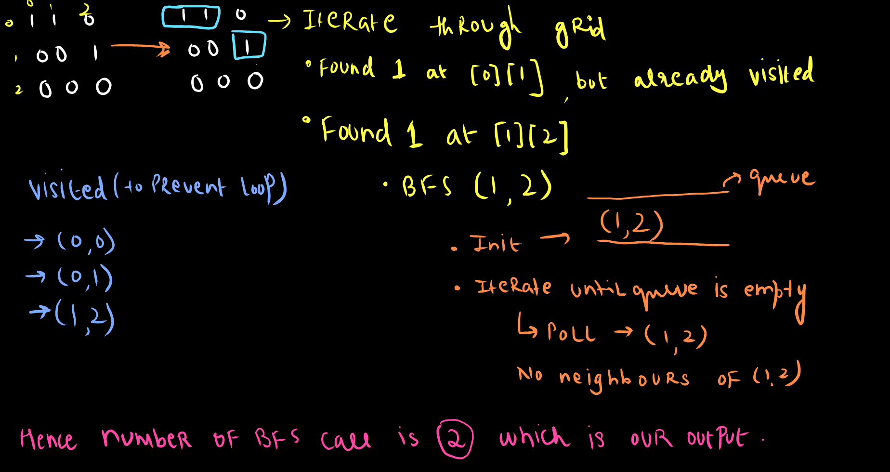

import Tabs from '@theme/Tabs';
import TabItem from '@theme/TabItem';

export const Highlight = ({children, color,txt}) => (
  <span
    style={{
      backgroundColor: color,
      borderRadius: '2px',
      color: '#fff',
      padding: '0.2rem',
    }}>
    {children}
  </span>
);

Level - <Highlight color="#fece2f">Medium</Highlight>

### Statement:

> Given an m x n 2D binary grid grid which represents a map of '1's (land) and '0's (water), return the number of islands.

An island is surrounded by water and is formed by connecting adjacent lands horizontally or vertically. You may assume all four edges of the grid are all surrounded by water.

### Example 1


```
Input: grid = [
  ["1","1","0","0","0"],
  ["1","1","0","0","0"],
  ["0","0","1","0","0"],
  ["0","0","0","1","1"]
]
Output: 3
```

### Example 2

```
Input: grid = [
  ["1","1"],
  ["1","0"],
  ["1","0"],
  ["0","0"]
]
Output: 1

```

### You can try it at:

- https://leetcode.com/problems/number-of-islands/

### Algorithm

- we will solve this problem using **BFS** becuase in this there is connection between multiple `1`s which together will form an island.
- so we will loop through all the elements in the grid and if we found that there is `1` and we were visiting this element for `first` time then we will perform **BFS** and increment the number_of_island
- now in **BFS** we will perform some steps as follows:
    - create a `queue<int[]>` so inside queue we will be storing the co-ordinates `[x,y]`
    - then initialize the queue with starting `co-ordinate` and mark that co-ordinate as `visited` by `visited[x][y] = true`
    - then loop through below steps until and unless the `queue is empty`
        - `poll` the co-ordinate from queue
        - move in all the `4 directions` and if in any direction element is `1` and not visited, so `put that co-ordinate in the queue and visit that co-ordinate` 




----------------------------

 

### Code 

<Tabs>
<TabItem value="java" label="Java">

```js
 public void bfs(int x,int y,char[][] grid,boolean[][] visited,int n,int m){
        Queue<int[]> q = new LinkedList<>();
        int[] dx = {0,0,-1,1};
        int[] dy = {-1,1,0,0};
        
        // init the queue
        q.add(new int[]{x,y});visited[x][y] = true;
        while(!q.isEmpty()){
            int[] point = q.poll();
            // go to all the directions
            for(int i=0;i<4;i++){
                int new_x = dx[i]+point[0],new_y = dy[i]+point[1];
                if(new_x>=0 && new_x<n && new_y>=0 && new_y<m && grid[new_x][new_y]=='1' && !visited[new_x][new_y]){
                    q.add(new int[]{new_x,new_y});
                    visited[new_x][new_y] = true;
                }
            }
        }
        return;
    }
    public int numIslands(char[][] grid) {
        int n = grid.length;
        int m = grid[0].length;
        // track visited to avoid infinite loop
        boolean[][] visited = new boolean[n][m];
        int count = 0;
        
        for(int i=0;i<n;i++){
            for(int j=0;j<m;j++){
                if(grid[i][j]=='1' && !visited[i][j]){
                    bfs(i,j,grid,visited,n,m);
                    count++;
                }
            }
        }
        
        return count;
    }
```

</TabItem>

<TabItem value="other" label="Other">

```
currently no other languages supported
```

</TabItem>

</Tabs>

#### Complexity
  > Time Complexity: `O(N^2)`