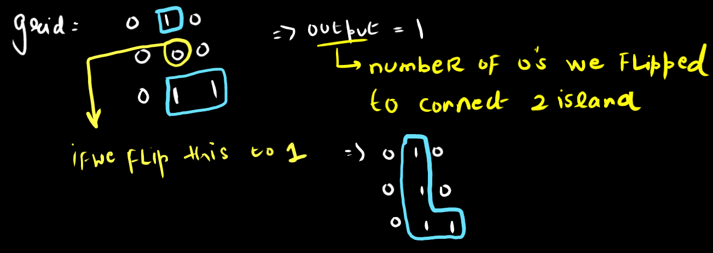

import Tabs from '@theme/Tabs';
import TabItem from '@theme/TabItem';

export const Highlight = ({children, color,txt}) => (
  <span
    style={{
      backgroundColor: color,
      borderRadius: '2px',
      color: '#fff',
      padding: '0.2rem',
    }}>
    {children}
  </span>
);

Level - <Highlight color="#fece2f">Medium</Highlight>

### Statement

> You are given an `n x n` binary matrix grid where `1 represents land` and `0 represents water`.

An island is a 4-directionally connected group of 1's not connected to any other 1's. `There are exactly two islands in grid`.

You may change `0's to 1's` to connect the two islands to form one island.

> Return the smallest number of 0's you must flip to connect the two islands.

### You can try it at

- https://leetcode.com/problems/shortest-bridge/

### Example 1

```
Input: grid = [[0,1,0],[0,0,0],[0,0,1]]
Output: 2
```


### Approach

- so we have exactly `2` islands and we need to figure out the `shortest distance` between the 2 islands
- in most of the problems to find the shortest distance we use `BFS` so in this problem we will be using `BFS` algo to calculate the distance from one island to another
- but one thing is important in this problem that for the particular island there are multiple land which is connected to form that island so we need to perform the `BFS` using all that land part as our source. so here we use `multi source BFS`
- so first of all we need to gather all the land part for any island and put it in the `queue` and start the `BFS` process
- so we will use `DFS` to get all the land part for one of the island

### Basic Algo Overview

```
  for(int i=0;i<n;i++){
      for(int j=0;j<n;j++){
          if(grid[i][j]==1){
              dfs(i,j,grid,visited);// so dfs helps to store all the 1's location of one of the island
              // now dfs mark all the land part of an island as visited so now we can perform simply the multisource BFS 
              return bfs(grid,visited);
          }
      }   
  }

```


----------------


### Code 

<Tabs>
<TabItem value="java" label="Java">

```js
public void dfs(int x,int y,int[][] grid,boolean[][] visited){
        // the out of bound case check up
        if(x < 0 || y < 0 || x>=grid.length || y>=grid.length)return; 
        // check for not visited and should be the piece of land only
        if(visited[x][y] || grid[x][y]==0)return;
        
        // if control reach here means yet not visited and a land is there so include it into visited matrix
        visited[x][y] = true;
        
        int[] dx = {-1,1,0,0};
        int[] dy = {0,0,-1,1};
        
        // move in all the 4 directions
        for(int i=0;i<4;i++){
            int new_x = dx[i]+x,new_y = dy[i]+y;
            dfs(new_x,new_y,grid,visited);    
        }
    }
    
    public int bfs(int[][] grid,boolean[][] visited){
        int n = grid.length;
        // queue will contain the [x,y]
        Queue<int[]> q = new LinkedList<>();
        // init the queue with all the visited node which will be our initial node for multisource bfs means all our source
        for(int i=0;i<n;i++){
            for(int j=0;j<n;j++){
                if(visited[i][j])
                q.add(new int[]{i,j});
            }
        }
        int res = 0;
        // directions
        int[] dx = {-1,1,0,0};
        int[] dy = {0,0,-1,1};
        // iterate through the queue
        while(!q.isEmpty()){
            int size = q.size();
            // iterate level by level in bfs
            for(int k=0;k<size;k++){
                int[] point = q.poll();
                System.out.print(point[0]+" "+point[1]+", ");
                for(int i=0;i<4;i++){
                    int new_x = point[0]+dx[i],new_y = point[1]+dy[i];
                    if(new_x < n && new_y < n && new_x>=0 && new_y>=0 && !visited[new_x][new_y]){
                        // visit them and add in the queue
                        visited[new_x][new_y] = true;
                        // if we found the land part means we have reached to another island
                        if(grid[new_x][new_y]==1)return res;
                        // else add it to the queue
                        q.add(new int[]{new_x,new_y});
                    }
                }
            }
            System.out.println();
            res++;
        }
        return res;
    }
    
    public int shortestBridge(int[][] grid) {
        int res = 0;
        int n = grid.length;// sqare matrix n*n
        boolean[][] visited = new boolean[n][n];//visted matrix to not repeat the same process to prevent the infinite loop
        // loop through the grid 
        for(int i=0;i<n;i++){
            for(int j=0;j<n;j++){
                // if we found the land means it is the part of one of the island so perform dfs so that we can get all the land part which belongs to one of that island
                if(grid[i][j]==1){
                    dfs(i,j,grid,visited);// so dfs helps to store all the 1's location of one of the island
                    // now dfs mark all the land part of an island as visited so now we can perform simply the multisource BFS 
                    return bfs(grid,visited);
                }
            }   
        }
        return res;
    }

```

</TabItem>

<TabItem value="other" label="Other">

```
currently no other languages supported
```

</TabItem>

</Tabs>