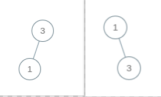
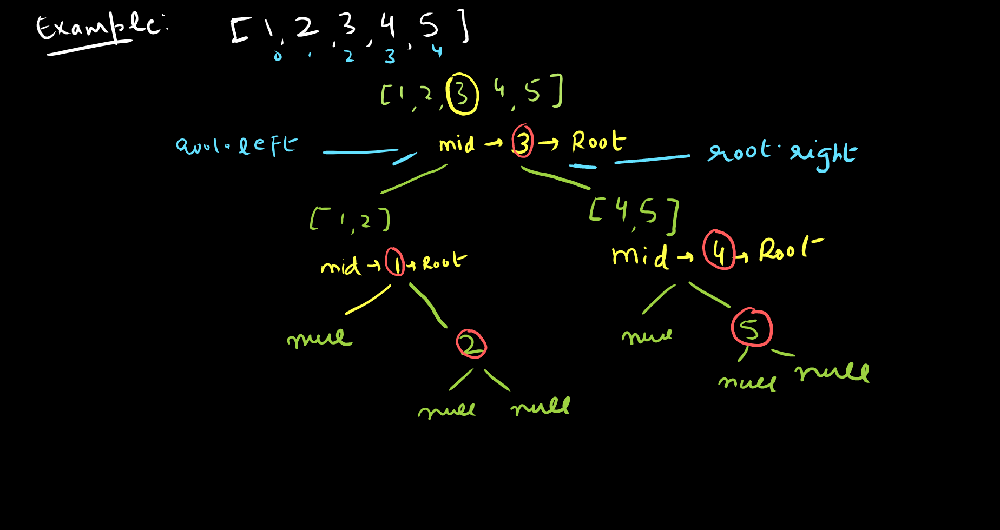

import Tabs from '@theme/Tabs';
import TabItem from '@theme/TabItem';

export const Highlight = ({children, color,txt}) => (
  <span
    style={{
      backgroundColor: color,
      borderRadius: '2px',
      color: '#fff',
      padding: '0.2rem',
    }}>
    {children}
  </span>
);

Level - <Highlight color="#25c2a0">Easy</Highlight>

### Statement:

> Given an integer array nums where the elements are sorted in ascending order, convert it to a `height-balanced` binary search tree.

### What is height-balanced tree ?

> a binary tree in which the left and right subtrees of every node differ in height by not more than `1`

### You can Try it at:

- https://leetcode.com/problems/convert-sorted-array-to-binary-search-tree/

### Example

`Input`: nums = [1,3]
`Output`: 




### Approach:




<Tabs>
<TabItem value="java" label="Java">


```js
    public TreeNode generate(int start,int end,int[] in){
        if(start <= end){
            int mid = (start + end)/2;
            TreeNode root = new TreeNode(in[mid]);
            root.left = generate(start,mid-1,in);
            root.right = generate(mid+1,end,in);
            return root;
        }
        return null;
    }
    public TreeNode sortedArrayToBST(int[] nums) {
        return generate(0,nums.length-1,nums);   
    }
```

</TabItem>

<TabItem value="other" label="Other">

```
currently no other languages supported
```

</TabItem>

</Tabs>