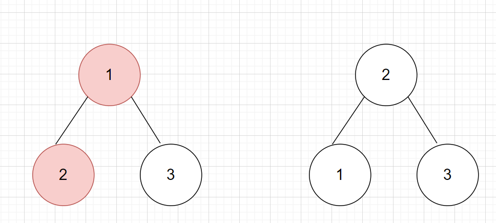

import Tabs from '@theme/Tabs';
import TabItem from '@theme/TabItem';

export const Highlight = ({children, color,txt}) => (
  <span
    style={{
      backgroundColor: color,
      borderRadius: '2px',
      color: '#fff',
      padding: '0.2rem',
    }}>
    {children}
  </span>
);

Level - <Highlight color="#fece2f">Medium</Highlight>

### Statement

> You are given the root of a `binary search tree (BST)`, where the values of exactly two nodes of the tree were swapped by mistake. Recover the tree without changing its structure.

### You can try it at

- https://leetcode.com/problems/recover-binary-search-tree/

### Example 1


```
Input: root = [1,3,null,null,2]
Output: [3,1,null,null,2]
Explanation: 3 cannot be a left child of 1 because 3 > 1. Swapping 1 and 3 makes the BST valid.
```

### Example 2


```
Input: root = [2,1,3]
Output: [1,2,3]
Explanation: swapping 1 and 2 results in valid BST.
```

<Tabs>
<TabItem value="java" label="Java">

```js
class Solution {
    TreeNode prev = null,first = null,sec = null,third = null;
    public void inorder(TreeNode root){
        if(root==null)return;
        inorder(root.left);
        if(prev!=null && prev.val > root.val){
            // means have to recover
            if(first==null){
                first = prev;
                sec = root;
            }else{
                third = root;// to cover the second case
            }
        }
        prev = root;// track the prev to compare
        inorder(root.right);
    }
    public void recoverTree(TreeNode root) {
        inorder(root);
        if(third==null){
            // first case 
            int t = first.val;
            first.val = sec.val;
            sec.val = t;
        }else{
            // second case
            int t = first.val;
            first.val = third.val;
            third.val = t;
        }
    }
}

```

</TabItem>

<TabItem value="other" label="Other">

```
currently no other languages supported
```

</TabItem>

</Tabs>