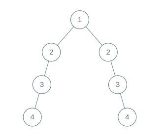
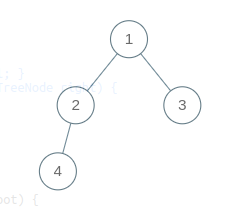
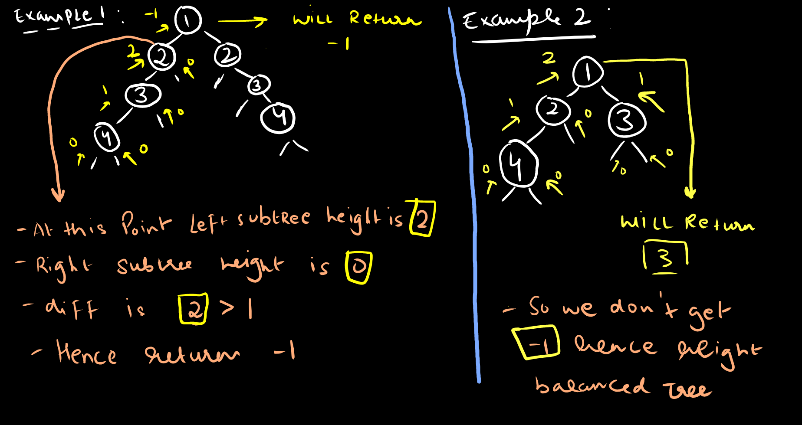

import Tabs from '@theme/Tabs';
import TabItem from '@theme/TabItem';

export const Highlight = ({children, color,txt}) => (
  <span
    style={{
      backgroundColor: color,
      borderRadius: '2px',
      color: '#fff',
      padding: '0.2rem',
    }}>
    {children}
  </span>
);

Level - <Highlight color="#25c2a0">Easy</Highlight>

### Statement

> Given a binary tree, determine if it is `height-balanced` or not.

### What is height-balanced tree ?

> a binary tree in which the left and right subtrees of every node differ in height by not more than `1`

### Example 1:
```
Input: [1,2,2,3,null,null,3,4,null,null,4]
Output: false
```


### Example 2
```
Input: root = []
Output: true
```
### Example 3
```
Input: [1,2,3,4]
Output: true
```



### You can try it at:
- https://leetcode.com/problems/balanced-binary-tree/


### Approach

- so on each and every node we calculate the height of `left subtree` and height of `right subtree`
- and if there difference is greater then `one` then return `-1` and end the `recursion`
- otherwise return the height till now , so return `Math.max(left,right)+1`  



<Tabs>
<TabItem value="java" label="Java">

```js
    public int height(TreeNode root){
        // if root is null then height is 0
        if(root==null)return 0;
        int left = height(root.left);
        int right = height(root.right);
        // if any one return -1 means tree is not balanced
        if(left==-1 || right==-1)return -1;
        // if diff is bigger then 1 return -1
        int diff = Math.abs(left-right);
        if(diff > 1)return -1; 
        // return the height of tree
        return Math.max(left,right)+1;
    }
    public boolean isBalanced(TreeNode root) {
        return height(root)!=-1 ? true : false;
    }
```

</TabItem>

<TabItem value="other" label="Other">

```
currently no other languages supported
```

</TabItem>

</Tabs>

#### Complexity
  > Time Complexity: `O(N)`

  > Space Complexity: `O(h) ~ O(N)` where `h` is the height of binary tree