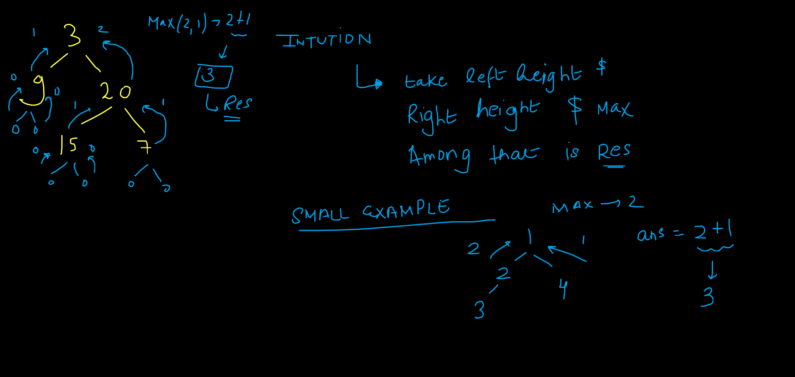

import Tabs from '@theme/Tabs';
import TabItem from '@theme/TabItem';

export const Highlight = ({children, color,txt}) => (
  <span
    style={{
      backgroundColor: color,
      borderRadius: '2px',
      color: '#fff',
      padding: '0.2rem',
    }}>
    {children}
  </span>
);

Level - <Highlight color="#25c2a0">Easy</Highlight>

### Statement

> Given the `root` of a binary tree, return its `height`.

### what is height of binary tree ?

> height of the binary tree can be defined as the maximum or the largest number of edges from root node to the leaf node.

### Example

 > Input: root = [3,9,20,null,null,15,7]

 > Output: 3


### Explanation



<Tabs>
<TabItem value="java" label="Java">


```js
/**
 * Definition for a binary tree node.
 * public class TreeNode {
 *     int val;
 *     TreeNode left;
 *     TreeNode right;
 *     TreeNode() {}
 *     TreeNode(int val) { this.val = val; }
 *     TreeNode(int val, TreeNode left, TreeNode right) {
 *         this.val = val;
 *         this.left = left;
 *         this.right = right;
 *     }
 * }
 */
 public int height(TreeNode root) {
        if(root==null)return 0;
        
        int left = height(root.left);
        int right = height(root.right);
        
        return Math.max(left,right)+1; 
}
```

</TabItem>

<TabItem value="other" label="Other">

```
currently no other languages supported
```

</TabItem>

</Tabs>

#### Complexity
  > Time Complexity: `O(N)`

  > Space Complexity: `O(h) ~ O(N)` where `h` is the height of binary tree