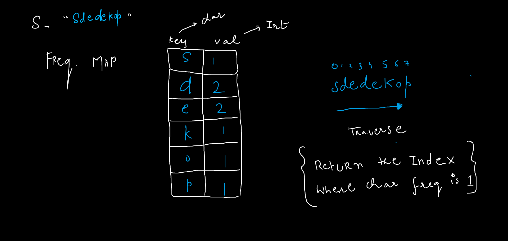

import Tabs from '@theme/Tabs';
import TabItem from '@theme/TabItem';

export const Highlight = ({children, color,txt}) => (
  <span
    style={{
      backgroundColor: color,
      borderRadius: '2px',
      color: '#fff',
      padding: '0.2rem',
    }}>
    {children}
  </span>
);

Level - <Highlight color="#25c2a0">Easy</Highlight>

### Statement

> given a string `s` you have to return the index of a string of first non-repeating character, if every character in a string is repeated then return -1

### Example 1

> Input: `sdedekop`

> Output: `0`

> Explaination: in `sdedekop` non-repeating char are `s`,`k`,`o`,`p` first one is **s** at index `0`

### Example 2

> Input: `sde`

> Output: `-1`

> Explaination: in `sde` no non-repeating char exists so return `-1`

### Brute-Force Method
 - with the help of `nested loop` we can compare each character with all other characters in a string
 - then the first char which does't repeat in the string is our answer


<Tabs>
<TabItem value="java" label="Java">

```js
    public int firstUniqChar(String s) {
        for(int i=0;i<s.length();i++){
            char c = s.charAt(i);
            int cnt = 0;
            for(int j=i=0;j<s.length();j++){
                if(i!=j && c==s.charAt(j))cnt++;
            }
            if(cnt==0)return i;
        }
        return -1;
}
```

</TabItem>

<TabItem value="other" label="Other">

```
currently no other languages supported
```

</TabItem>

</Tabs>

#### Complexity
  > Time Complexity: `O(N^2)`
  
  > Space Complexity: `O(1)`

### Optimal Approach 
  - we will create a frequency count for each character
  - then traverse character from start and the first character with frequency `1` is our answer




<Tabs>
<TabItem value="java" label="Java">

```js
public int firstUniqChar(String s) {
        int[] freq = new int[256];
        for(char c: s.toCharArray()){
            freq[c]++;
        }
        for(int i=0;i<s.length();i++){
            if(freq[s.charAt(i)]==1)return i;
        }
        return -1;
}
```

</TabItem>

<TabItem value="other" label="Other">

```
currently no other languages supported
```

</TabItem>

</Tabs>

#### Complexity 
  > Time Complexity: `O(N)`
  
  > Space Complexity: `O(N)`

:::note

if you use `hashmap` for storing the char frequency then Space Complexity is `O(N)` else if you use `char array` to store the frequency then it will take `256` block then space Complexity is `O(256) ~ constant`  

:::


:::tip

always use `char array` for storing character frequency

:::