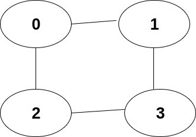

## What is **BFS** ?

import Tabs from '@theme/Tabs';
import TabItem from '@theme/TabItem';

> **BFS** stands for Breadth First Search, it is an algorithm which helps us to traverse the Graph. so **BFS** algorithms are generally used in solving graph related problems.

> We put **BFS** section inside **Queue** because it uses **Queue** as a data structure to traverse in desired manner.

### Example 

> Lets take and `adjacency list` for an `undirected graph`

```
Input:

adjacency_list: [{1,2},{0,3},{0,3},{1,2}]
V(number of vertices): 4
```


>  `adjacency_list[0]` is `{1,2}` so `0` is connected to `{1,2}`

### How BFS works ?


#### Algorithm


#### Pictorial Representation


### Code

<Tabs>
<TabItem value="java" label="Java">

```js

import java.util.*;

class Main {
    public static void main(String[] args) {
        // adj_list sample
        ArrayList<ArrayList<Integer>> adj_list = new ArrayList<>();
        // 0 -> 1,2
        adj_list.add(new ArrayList<>(Arrays.asList(1,2)));
        // 1 -> 0,3
        adj_list.add(new ArrayList<>(Arrays.asList(0,3)));
        // 2 -> 0,3
        adj_list.add(new ArrayList<>(Arrays.asList(0,3)));
        // 3 -> 1,2
        adj_list.add(new ArrayList<>(Arrays.asList(1,2)));
        int[] res = bfs(adj_list,4);
        for(int r: res)System.out.print(r+" ");
    }
    public static int[] bfs(ArrayList<ArrayList<Integer>> adj_list,int V){
        int[] res = new int[V]; 
        // queue which consists of vertices
        Queue<Integer> q = new LinkedList<>(); 
        // visited array to avoid the loop
        boolean[] vis = new boolean[V];
        //init the queue and visit the source
        q.add(0);vis[0] = true;
        int index = 0;
        //iterate the queue
        while(!q.isEmpty()){
            int peak = q.poll();
            // add it to the result
            res[index++] = peak;
            
            // iterate through all the neighbours
            for(Integer neigh: adj_list.get(peak)){
                // not visited neighbours
                if(!vis[neigh]){
                    // add in queue ans , visit the node 
                    q.add(neigh);
                    vis[neigh] = true;
                }
            }
        }
        
        return res;
    }
}

    
```

</TabItem>

<TabItem value="other" label="Other">

```
currently no other languages supported
```

</TabItem>

</Tabs>