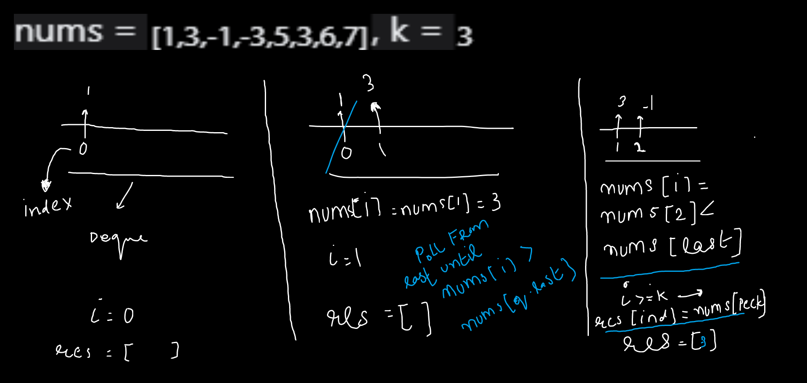
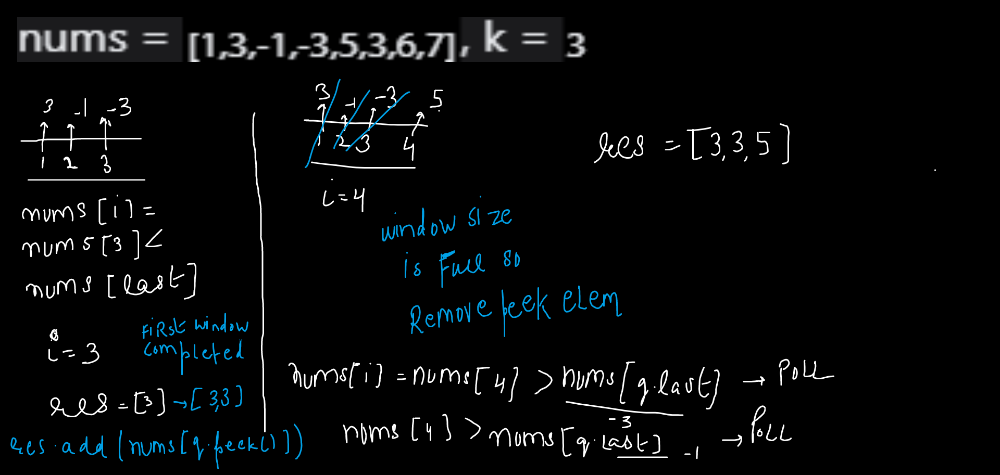
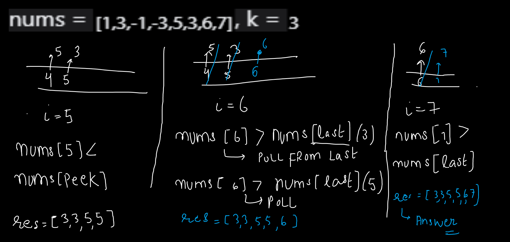

import Tabs from '@theme/Tabs';
import TabItem from '@theme/TabItem';

export const Highlight = ({children, color,txt}) => (
  <span
    style={{
      backgroundColor: color,
      borderRadius: '2px',
      color: '#fff',
      padding: '0.2rem',
    }}>
    {children}
  </span>
);

Level - <Highlight color="#cc0000">Hard</Highlight>

### Statement

> you are given an array `nums` and a window size `k`. the window start from very left to very right.so you have to return an array consist of Maximum of all the windows.

### Example 1

> Input: nums = `[1,3,-1,-3,5,3,6,7]`, k = `3`

> Output: `[3,3,5,5,6,7]`

> Explanation: 
```
Window position                Max
---------------               -----
[1  3  -1] -3  5  3  6  7       3
 1 [3  -1  -3] 5  3  6  7       3
 1  3 [-1  -3  5] 3  6  7       5
 1  3  -1 [-3  5  3] 6  7       5
 1  3  -1  -3 [5  3  6] 7       6
 1  3  -1  -3  5 [3  6  7]      7
```


### Brute-Force Method

- in this method we will loop through all the windows and track maximum in following windows
- so if `n` is the size of the array and `k` is the window size then `n-k+1` windows are there
- in inner loop track the max element in that window

<Tabs>
<TabItem value="java" label="Java">

```js
    public int[] maxSlidingWindow(int[] nums, int k) {
        int n = nums.length;
        int index = 0;
        int[] res = new int[n-k+1];
        for(int i=0;i<=n-k;i++){
            int maxi = Integer.MIN_VALUE;
            for(int j=i;j<=i+k-1;j++){
                maxi = Math.max(maxi,nums[j]);
            }
            res[index] = maxi;
            index++;
        }
        return res;
}
```

</TabItem>

<TabItem value="other" label="Other">

```
currently no other languages supported
```

</TabItem>

</Tabs>

#### Complexity
  > Time Complexity: `O(N^2)`

  > Space Complexity: `O(1)`

### Optimal Approach 

- we will use `deque` to maintain `maximum element` at `peek end` and insert the element from `last` 
- we have to maintain the `decreasing order` in the `queue` so pop the element from `last` if it is less that the element to be `inserted`
- iterate through the array and at each step
    - check that deque only have k elements so if current index `i-k`>=`dq.peek()` means remove the peek element, means slide the window
    - check that element at current index `i` if bigger then `dq.last()` element then remove `dq.last()` and insert `incoming element` to the last, repeat until this condition fails  
    - add current element at index `i` in the window
    - if current index `i` >= `k-1`, means first window is processed then add the peak element in the result array 



<p style={{textAlign: "center"}}>Figure 1.1</p>


<p style={{textAlign: "center"}}>Figure 1.2</p>


<p style={{textAlign: "center"}}>Figure 1.3</p>


<Tabs>
<TabItem value="java" label="Java">

```js
    public int[] maxSlidingWindow(int[] nums, int k) {
        // arr size is n and window size is k
        // so n-k+1 windows are there (simple math)
        int n = nums.length;
        int[] result = new int[n-k+1];
        int index = 0;
        
        // deque for maintaining max element in window - storing index 
        Deque<Integer> dq = new LinkedList<>();
        for(int i=0;i<n;i++){
            // maintain at most k elements in queue
            while(!dq.isEmpty() && i-k>=dq.peek()){
                dq.poll();
            }
            // maintaing the decreasing order in queue from left to right
            // so we have to maintain large element in window at peek point
            while(!dq.isEmpty() && nums[dq.peekLast()] < nums[i]){
                dq.pollLast();
            }
            // add the current elem
            dq.add(i);
            // if completed the first window add into the result
            if(i>=k-1){
                result[index] = nums[dq.peek()];
                index++;
            }
        }
        return result;
}
```

</TabItem>

<TabItem value="other" label="Other">

```
currently no other languages supported
```

</TabItem>

</Tabs>

#### Complexity
  > Time Complexity: `O(N)+O(N) ~ O(N)`

  > Space Complexity: `O(K)`
