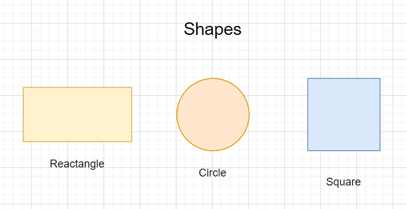

### Abstract Classes and Methods

> **Abstraction** is the process of hiding certain complexities and showing only essential information to the user.
Abstraction can be achieved with either **abstract classes** or **interfaces**.

### Abstraction in Java

**Abstract class**: abstract class is a class with abstract keyword and we can't able to intantiate the object hence can't able to create the object using abstract class.

**Abstract method**: can only be used in an abstract class, and it does not have a body. The body is provided by the subclass.

> An abstract class can have both `abstract` and `regular` methods

### Why we need Abstract Class ?

> let's understand with a very clear example

> suppose we have have a `shape` class with a method `area`, now there can be multiple shapes. so we create different class as a subclass of `superclass(shape)` and override the `area` method as different shapes have different area formula. 



```js
class Shape{
  int area(int[] arr){
    // arr consists of values required to calculate the formula
    return 0;
  }
}

class Rectangle{
  int area(int[] arr){
    // length * width
    return arr[0]*arr[1];
  }
}

```

> now in this class there is no sense in creating a object for the class shape as we did'nt know about the area formula hence in this case we use **Abstract Class**.

### Code

```js

abstract class Shape{
    abstract int area(int[] arr);
}

class Rectangle extends Shape{
    @Override
    int area(int[] arr){
        return arr[0]*arr[1];
    }
}

class Circle extends Shape{
    @Override
    int area(int[] arr){
        return (int)3.14*arr[0]*arr[0];
    }
}

public class Main {
    public static void main(String[] argv){
        Shape rectangle = new Rectangle();
        System.out.println("area of rectangle is: "+rectangle.area(new int[]{2,3}));
        Shape circle = new Circle();
        System.out.println("area of circle is: "+circle.area(new int[]{10}));
    }
}

```


